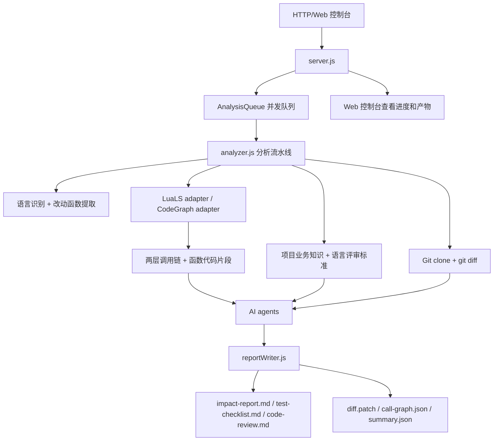

# linuxaiimpact 项目流程框架

## 1. 项目目标

`linuxaiimpact` 是一个面向代码变更的 AI 影响面分析服务。用户通过 HTTP 提交项目名称、Git 地址、分支和对比 commit，服务自动拉取代码、生成 diff、识别语言和改动函数、收集默认两层调用链和函数代码片段，再结合项目业务知识、语言评审标准和 AI agent 生成专业报告。

最终产物写入：

```text
/data/impact/<项目>/<项目>_<分支>_<时间戳>/
```

## 2. 总体架构



## 3. 启动与离线依赖

入口脚本：

```text
start.sh
```

启动流程：

1. 检查 Node.js 版本，要求 `>=22.18.0`。
2. 创建 `${DATA_ROOT:-/data}/impact`。
3. 执行 `scripts/install-tools.sh`。
4. 将 `tools/vendor/bin` 加入 `PATH`。
5. 设置 `LUALS_BIN` 和 `CODEGRAPH_BIN`。
6. 启动 `node src/main.js`。

离线依赖目录：

```text
tools/offline/
```

当前已内置：

- `lua-language-server-3.18.2-linux-x64.tar.gz`
- `lua-language-server-3.18.2-linux-arm64.tar.gz`
- `codegraph-linux-x64.tar.gz`
- `codegraph-linux-arm64.tar.gz`

安装脚本会优先从这些离线包解压安装。无离线包时才尝试联网下载 release。

## 4. HTTP 与 Web 控制台

服务入口：

```text
src/main.js
src/server.js
```

核心路由：

| 路由 | 作用 |
| --- | --- |
| `GET /` | Web 控制台 |
| `POST /api/analyze` | 创建分析任务 |
| `GET /api/jobs` | 查看任务列表和队列状态 |
| `GET /api/jobs/:jobId` | 查看单个任务状态 |
| `GET /api/jobs/:jobId/artifacts/:artifactName` | 查看指定产物内容 |
| `GET /health` | 健康检查 |

Web 控制台文件：

```text
public/index.html
public/app.js
public/styles.css
public/favicon.svg
```

控制台能力：

- 查看队列并发、运行中、排队中数量。
- 查看任务列表、任务状态和进度。
- 查看进度历史。
- 在线查看报告、测试清单、评审报告、Git diff、调用链 JSON 和摘要 JSON。

## 5. 队列与任务进度

队列实现：

```text
src/queue.js
```

任务存储：

```text
src/jobStore.js
```

默认并发：

```json
{
  "concurrency": 2
}
```

任务阶段：

| 阶段 | 说明 |
| --- | --- |
| `queued` | 请求已入队 |
| `prepare` | 准备产物目录 |
| `git_diff` | 拉取仓库并获取 Git diff |
| `language_scan` | 识别语言、变更文件和改动函数 |
| `call_graph` | 采集两层调用链和代码片段 |
| `ai_analysis` | 调用 AI agents 生成分析内容 |
| `write_reports` | 写入报告和产物 |
| `completed` | 分析完成 |
| `failed` | 分析失败 |

## 6. 分析流水线

主流程：

```text
src/analyzer.js
```

步骤：

1. 创建产物目录。
2. `git clone` 指定分支。
3. 基于 `baseCommit...HEAD` 生成：
   - `git diff --unified=80`
   - `git diff --name-status`
4. 解析变更文件和语言。
5. 从 diff hunk 中提取改动函数。
6. 加载项目业务知识和特殊说明。
7. 加载语言评审标准。
8. 采集两层调用链和函数代码片段。
9. 调用 AI agents。
10. 写入全部产物。

## 7. Git diff 保存

Git diff 获取：

```text
src/gitRepository.js
```

产物路径：

```text
diff.patch
```

`summary.json` 中也会记录：

```json
{
  "artifacts": {
    "diff": ".../diff.patch"
  }
}
```

## 8. 语言识别与改动函数

解析实现：

```text
src/diffParser.js
```

当前支持：

- Lua：`.lua`
- C/C++：`.c`、`.h`、`.cc`、`.cpp`、`.cxx`、`.hpp`、`.hh`、`.hxx`

改动函数从 diff hunk 上下文提取。若 hunk 无函数上下文，报告会提示人工结合 `diff.patch` 复核。

## 9. 两层调用链

默认配置：

```json
{
  "callGraph": {
    "depth": 2,
    "maxNodes": 80,
    "codeContextLines": 20
  }
}
```

工具适配：

```text
src/toolAdapters.js
src/staticCallGraph.js
```

Lua：

- 调用 `lua-language-server` release 二进制做工具可用性接入。
- 静态降级解析 Lua 函数体，默认采集两层 caller/callee 和代码片段。

C/C++ 和其他非 Lua：

- 每个项目调用前执行 `codegraph init -i`。
- 再执行 `codegraph status`。
- 同时使用静态降级结果保证报告有两层链路结构和代码片段。

调用链产物：

```text
call-graph.json
```

关键字段：

- `depth`
- `tools`
- `entries`
- `entries[].nodes`
- `entries[].relationships`
- `entries[].nodes[].code`

## 10. 业务知识与评审标准

项目业务知识来源：

```text
.aiimpact/business.md
.aiimpact/special-notes.md
.aiimpact/knowledge.md
knowledge/projects/<项目名>.md
```

加载实现：

```text
src/knowledge.js
```

语言评审标准：

```text
standards/lua.md
standards/c_cpp.md
```

## 11. AI agents 分工

实现：

```text
src/agents.js
src/ai/client.js
src/ai/config.js
```

agents：

| Agent | 职责 |
| --- | --- |
| `diff` | 总结技术变更、语言、文件和关键函数 |
| `callGraph` | 基于两层调用链和函数代码片段总结上下游影响 |
| `businessImpact` | 结合业务知识、特殊说明、调用链代码输出业务影响 |
| `testChecklist` | 生成业务测试、回归、异常路径和上线验证清单 |
| `review` | 结合语言评审标准、diff 和影响面输出代码评审 |

支持 provider：

- `openai`
- `claude` / `anthropic`
- `minimax` / `minmax`
- `ollama` / `ollm`
- `offline`

未配置 API key 时，服务会使用离线规则引擎生成基础内容，并在报告中标记 provider 跳过或失败原因。

## 12. 报告模板

模板文件：

```text
templates/impact-report-template.md
templates/test-checklist-template.md
templates/code-review-template.md
```

生成实现：

```text
src/reportWriter.js
```

模板参考：

```text
docs/template-references.md
```

报告结构综合了 ISO/IEC/IEEE 29119、IEEE 829 风格测试计划、NASA 变更影响分析和 SEI 回归测试思想。

## 13. 产物清单

每次分析生成：

| 文件 | 说明 |
| --- | --- |
| `diff.patch` | Git diff 原文 |
| `call-graph.json` | 两层调用链、工具状态和代码片段 |
| `impact-report.md` | 影响面分析报告 |
| `test-checklist.md` | 专业测试清单 |
| `code-review.md` | 代码评审报告 |
| `summary.json` | 请求、语言、文件、函数和产物路径摘要 |

## 14. 测试覆盖

测试目录：

```text
tests/
```

重点覆盖：

- 队列并发控制。
- HTTP 请求校验和任务查询。
- Web 控制台静态页面。
- 任务进度更新。
- 产物内容读取 API。
- Git diff 保存。
- 语言识别和函数提取。
- 默认两层调用链和代码片段。
- 报告模板稳定章节。
- 离线工具压缩包存在和安装脚本。

运行：

```bash
npm test
```

## 15. 部署使用流程

无网 Linux 容器中：

```bash
git clone https://github.com/zhangzhangzhang1111/aiimpact.git
cd aiimpact
bash start.sh
```

浏览器打开：

```text
http://<host>:3000/
```

提交分析：

```bash
curl -X POST http://127.0.0.1:3000/api/analyze \
  -H 'content-type: application/json' \
  -d '{
    "projectName": "demo",
    "gitUrl": "https://github.com/example/demo.git",
    "branch": "main",
    "baseCommit": "abc123"
  }'
```

完成后可在 Web 控制台查看进度和全部产物内容。
